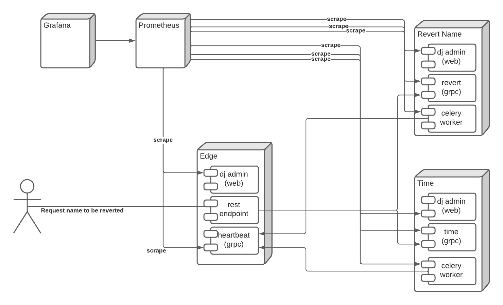
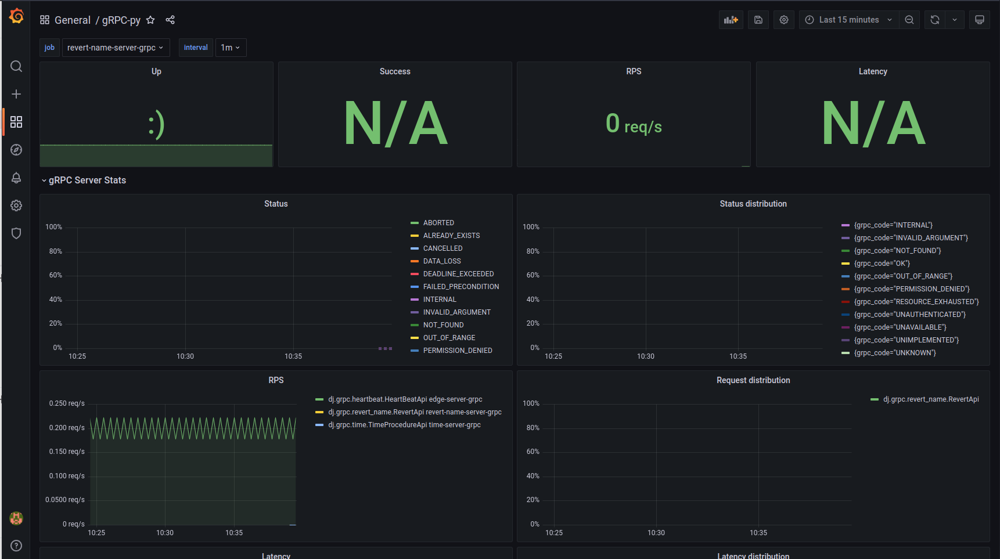

# P.O.C. django-grpc and prometheus

Prof of concept project to observe the grpc requests from the client and the server perspective and collect metrics about latency and error by method.

The focus was analise the grpc behavior, so this project should be used as its in production environment, it should be used as reference only.

The initialization of all the components and exposed ports are in docker-compose.yml file.

The observability of grpc requests in a django project need to be collect from three componentes: web (wsgi), grpc_server, celeryd


## The servers
 - All the servers has the django admin, grpc client and server behavior, time and revert name server has celery working as grpc client two with metrics we should collect.
 - Edge-server: 
   - rest endpoint that receive a name and call two others services, one to revert the name string order and other to receive the time. 
   - also has a grpc endpoint to receive the heartbeat of the others services.
 - Revert-Name-server: 
   - a django backend with a grpc endpoint that receive a name and invert the string order, 
   - also has a schedule task on celery beat to send a grpc request with the heartbeat to the edge server.  
 - Time-Server: 
   - a django backend with a grpc endpoint that response the time 
   - also has a schedule task on celery beat to send a grpc request with the heartbeat to the edge server.  
   

## The monitoring servers
 - Prometheus: Will scrape the metrics from the endpoint provide
 - Grafana: Will consume metrics from prometheus
 



## Running
```bash
$ docker-compose up
```


### Edge server local endpoints
 - web
    - http://localhost:8012/proxy/<name>/
    - http://localhost:8012/admin
 - grpc
   - http://localhost:50053 
     - BeatHeart
 - prometheus
    - web: http://localhost:8012/prometheus/metrics
    - grpc_server: http://localhost:9995
 

### Revert Name server local  endpoints
 - web
    - http://localhost:8011/admin
 - grpc
   - http://localhost:50052 
     - RevertName
 - prometheus
    - web: http://localhost:8011/prometheus/metrics
    - grpc_server: http://localhost:9998/
    - celery: http://localhost:9996
 

### Time server local  endpoints
 - web
    - http://localhost:8010/admin
 - grpc
   - http://localhost:50051 
     - WhatTimeIs
 - prometheus
    - web: http://localhost:8010/prometheus/metrics
    - grpc_server: http://localhost:9999/
    - celery: http://localhost:9997


### Prometheus 
 - web (no authentication)
    - http://localhost:9090


### Grafana 
- web (user: admin, password: admin)
   - http://localhost:3000


### Grafana Dashboard
 - There is an example dashboard in the project
   - grpc_grafana.json
 


### Metrics collected 
- Server side
  - grpc_server_started_total: total number of RPCs started on the server
  - grpc_server_handled_total: total number of RPCs completed on the server, regardless of success or failure
  - grpc_server_msg_received_total: Total number of stream messages received from the client 
  - grpc_server_msg_sent_total: Total number of stream messages sent by the server 
  - grpc_server_handling_seconds_count: the count of all completed RPCs by status and method
  - grpc_server_handling_seconds_sum: cumulative time of RPCs by status and method, useful for calculating average handling times
  - grpc_server_handling_seconds_bucket: contains the counts of RPCs by status and method in respective handling-time buckets. These buckets can be used by Prometheus to estimate SLAs

- Client side
  - grpc_client_started_total: Total number of RPCs started on the client. 
  - grpc_client_handled_total: Total number of RPCs completed on the client, regardless of success or failure. 
  - grpc_client_msg_received_total: Total number of stream messages received from the server. 
  - grpc_client_msg_sent_total: Total number of stream messages sent by the client.
  

### Problems and Solutions
 - We need to create a centralized grpc client that use prometheus interceptor
 - To monitor the grpc request from django web component (wsgi), we added an app: django_prometheus
   - this app collect the metrics and expose them at the url: /prometheus/metrics
 - The grpc server has no rest endpoint, so to export the metrics, we need to open a http port with prometheus format.
   - This http server is provided by the prometheus python client.
   - The grpc server entry point as changed to start prometheus http server together  
 - The celery worker server need some adjusts too
   - for each worker, celery create a new python subprocess, the prometheus client was build to use threads, and not work out of box for celery daemon
   - to solve this problem we need to use prometheus multiprocess mode
     - this solution has some limitation (see documentation reference about it)
     - to enable we need to set an env var PROMETHEUS_MULTIPROC_DIR, on this path the prometheus will create file to synchronize the metrics between the subprocess 
   - was defined a centralized prometheus "registry" on django settings, and it is used to create the grpc client prometheus interceptor and to open the prometheus endpoint
   - if environment variables for prometheus celery port was defined it means we can instantiate the prometheus endpoint as celeryd startup
     - to hook on celery initiation we use signals (see documentation)


## References
 - django-grpc: https://github.com/gluk-w/django-grpc
 - py-grpc-prometheus: https://github.com/lchenn/py-grpc-prometheus
 - prometheus: https://prometheus.io/
 - grafana: https://grafana.com/
 - grpc: https://grpc.io/docs/languages/python/quickstart/
 - protobuf: https://developers.google.com/protocol-buffers/docs/overview
 - prometheus multiprocess: https://github.com/prometheus/client_python#multiprocess-mode-eg-gunicorn
 - celery signals: https://docs.celeryproject.org/en/stable/userguide/signals.html


## TODO
 - Build a better grafana dashboard
 - Create grafana dashboard to observe the requests from the client side
 - Create a python library to centralize the knowledge from this p.o.c.
